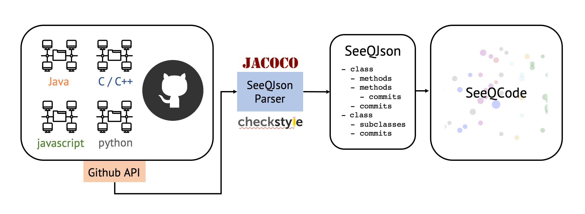

SeeQCodSeeQCode aims effective/efficient visualization and analysis of the contributions in a VCS repository from each author. By providing an extremely-free scalable interface, the manager can easily observe the commit history and measure the quality of the work done by each contributor.

##### Architecture

The overall program structure is like this:

1) Collects the repository info using Github API, and parses it.
   
2) By using the data from *step 1*, constructs the .json file following SeeQJson format.
   
3) Generates the web view derived from the result of *step 2*.
   
SeeQCode only accepts Java for the time being.  We selected Java as it has a robust class hierarchy design, and therefore easy to process data.  Also, various tools to analyze code had developed.  For example, we decided to use jacoco to measure test coverage. 